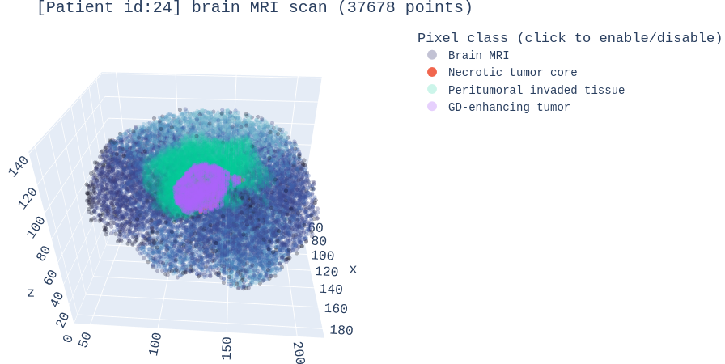

# MRI3D_Recon
Code for 3D reconstruction of MRI images Project

- Download dataset from here [link](https://drive.google.com/drive/folders/15PiXfGyONMNRMo9-ZDxUG6ph3qZfmpcH?usp=drive_link) and place it inside `./dataset` directory.

- Project Drive Link: [link](https://drive.google.com/drive/folders/1Mf8vUgaDhmSjm3LrQU2f-dT1o6a5i3a5?usp=sharing)

